<div align="center">

 &nbsp; 

# 🏢 VeriBayit

### מערכת SaaS לניהול ועד בית — בעברית מלאה, RTL

**[🌐 Live App](https://app.veribayit.com)** · **[📧 Contact](mailto:veribayit@gmail.com)**

</div>

---

<div dir="rtl">

## 📖 מה זה VeriBayit?

מערכת **VeriBayit** היא פתרון ענן מלא לניהול ועד בית — גזברות, גביה, ספקים, הצבעות דיגיטליות, ארכיון מסמכים ועוד.

פותחה כפרויקט אמיתי להחליף ניהול ידני ב-Excel/WhatsApp במערכת מקצועית עם נתונים שמורים בענן.

### למי זה מיועד?

- **גזברי ועד בית** שמחפשים להחליף ספרי חשבונות ידניים במערכת מקצועית
- **חברי וועד** שרוצים שקיפות בגביה והצבעות דיגיטליות
- **דיירים** שרוצים לראות חיובים, להצביע ולקבל מסמכים בקלות

</div>

---

## 📸 צילומי מסך

<div dir="rtl">

### 🔐 מסך כניסה והרשמה

מסך כניסה ייעודי עם 2 אופציות: כניסה מהירה עם Google או email+password. כפתור "הרשמה" יוצר אוטומטית בניין חדש למשתמש החדש (multi-tenant). תמיכה ב-show/hide סיסמה.

</div>

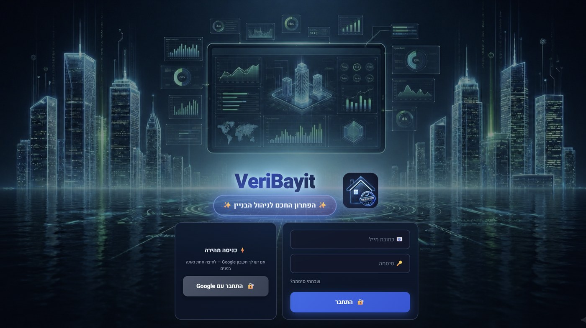

---

<div dir="rtl">

### 📊 דשבורד ראשי

תצוגת KPIs חודשיים, גרפים של הכנסות/הוצאות, באנרים חכמים, וסיכום שנתי.

</div>

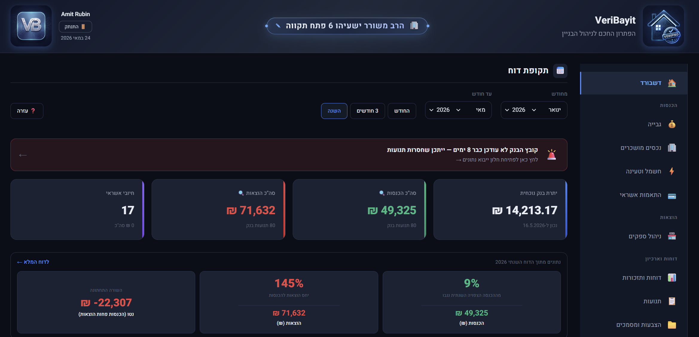


---

<div dir="rtl">

### 💰 גביה מדיירים

טבלת דירות עם חישוב חוב אוטומטי לפי FIFO. שורת דייר עם פירוט מלא, כפתור WhatsApp לכל דייר עם הודעת חוב מותאמת.

</div>

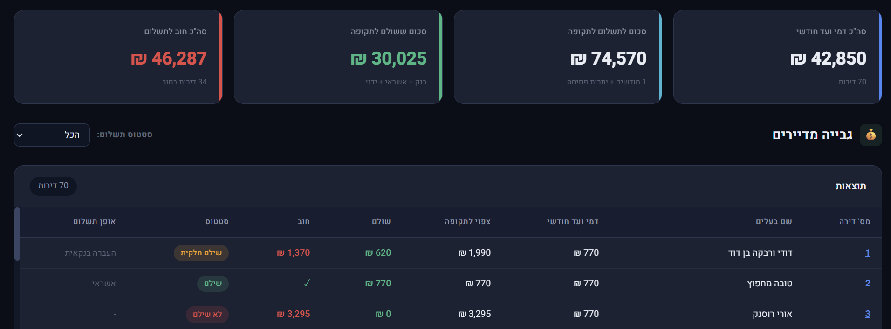

---

<div dir="rtl">

### 🏪 ניהול ספקים

ניהול ספקי הבניין (חשמל / מים / ניקיון / גינון / מעליות / וכו') עם תקופות מחיר, חוב, ותחזית.

</div>

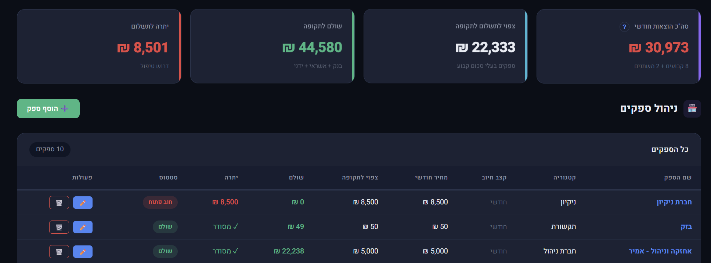

---

<div dir="rtl">

### 💳 התאמות אשראי (Reconciliation)

התאמת הפקדות אגרגטור (Growpay / PayMe וכו') לחיובי אשראי בודדים. תמיכה ב-partial matching + fast-track לאישור batch של חודש שלם בלחיצה אחת.

</div>

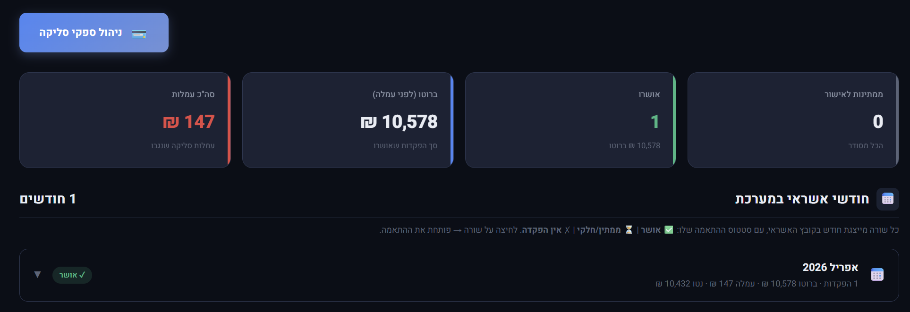

---

<div dir="rtl">

### 🏘 נכסים מושכרים

ניהול נכסים שהוועד משכיר (מחסן / חניה / חדר דיירים). כל נכס יכול להיות משויך לדייר ספציפי, עם חישוב שכר חודשי וחוב נפרד.

</div>

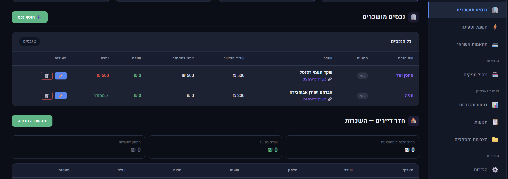

---

<div dir="rtl">

### ⚡ חשמל וטעינה

ניהול נקודות טעינה חשמליות בחניון — דייר / אורח / ועד, חישוב חיובים אישיים.

</div>

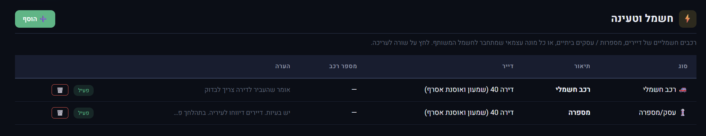

---

<div dir="rtl">

### 📊 דוחות עשירים

5 דוחות מובנים — שנתי / השוואתי / תקופתי / ספקים+תשלומים / דיירים. כולם עם **ייצוא PDF + Excel + הדפסה** בלחיצה אחת.

</div>

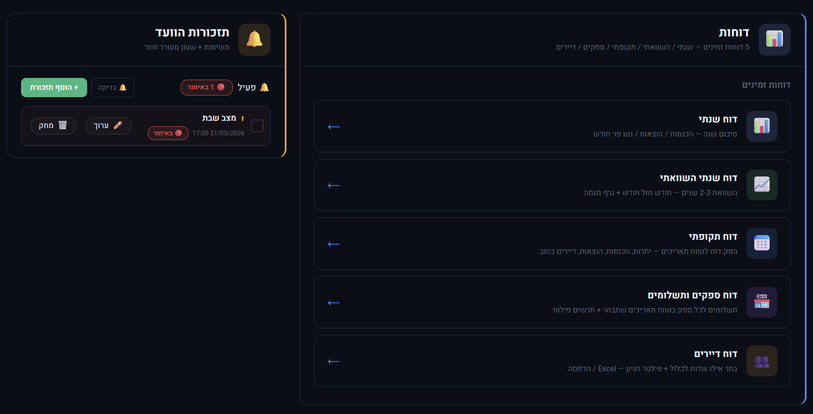

---

<div dir="rtl">

### 📁 מסמכים והצבעות

ארכיון מסמכים עם תיקיות מותאמות + drag&drop + תצוגה מקדימה. מערכת הצבעות דיגיטליות לדיירים עם שיתוף ב-WhatsApp ותוצאות חיות.

</div>

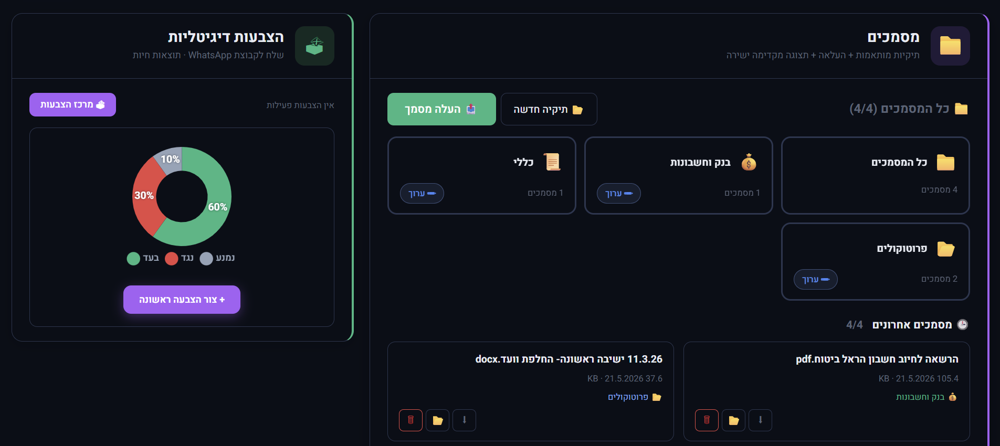

---

<div dir="rtl">

### ⚙️ הגדרות הבניין

ניהול מלא של תצורת הבניין דרך 6 לשוניות: דירות / סוגי דירות / ממשקי ייבוא / יתרות פתיחה / הודעה לדיירים / גיבוי.

#### 🏷 סוגי דירות עם תמחור

</div>

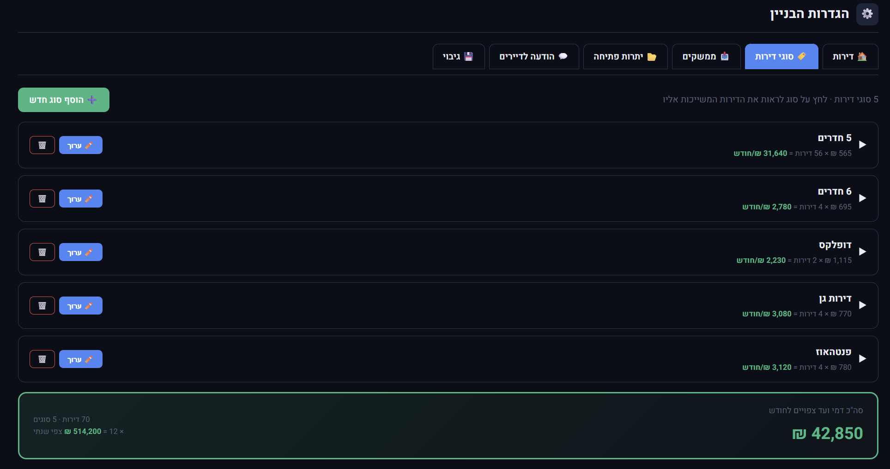

<div dir="rtl">

#### 📥 ממשקי ייבוא — 4 מקורות

</div>

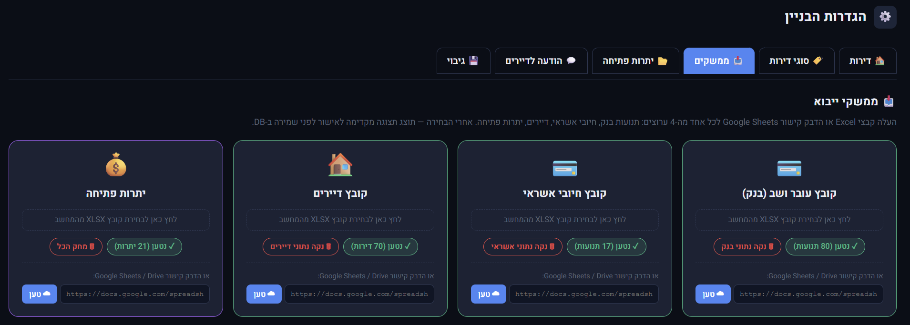

<div dir="rtl">

#### 💬 תבנית הודעת WhatsApp לדיירים

עורך תבנית עם תצוגה מקדימה חיה — placeholders אוטומטיים מוחלפים בנתוני הדייר.

</div>

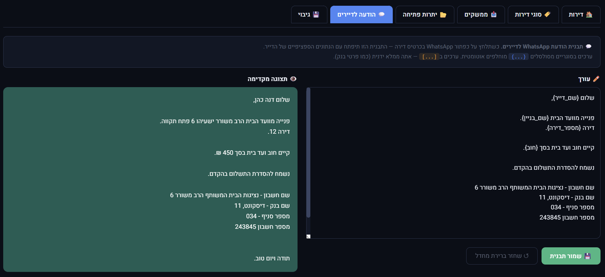

---

<div dir="rtl">

## ✨ פיצ'רים מרכזיים

### 💰 ניהול פיננסי מלא
- **ייבוא Excel** — תנועות בנק / אשראי / יתרות פתיחה / דיירים — עם מיפוי עמודות ידני, חיתוך חכם ובדיקת רצף יתרה
- **זיהוי דייר אוטומטי** — מערכת מתקדמת לזיהוי שם דייר בתיאור תנועה (compound prefixes, וריאנטים שונים של אותו שם)
- **חישוב חוב לפי FIFO** — אוטומטי לפי First-In-First-Out על כל התקופה
- **התאמת אשראי** (Reconciliation) — חיבור הפקדות אגרגטור לחיובים בודדים + partial matching
- **דמי ועד היסטוריים** — pricing periods לכל סוג דירה ולכל ספק

### 👥 דיירים
- ניהול דירות עם פרטים מלאים (בעלים, שוכר, פרטי קשר, חניה, מחסן)
- כרטיס דירה מפורט עם 7 KPIs + 2 לשוניות (חודשית / כרטסת) + 7 עמודות פירוט
- שליחת הודעות חוב ב-WhatsApp עם תבנית מותאמת (7 placeholders)
- סימוני חודש (פטור / סגור / מוקפא)
- תשלום ידני מזומן / המחאה

### 🏪 ספקים
- ניהול ספקי הבניין עם 5 תדירויות חיוב (חודשי / דו-חודשי / רבעוני / חצי-שנתי / שנתי)
- תקופות מחיר היסטוריות (pricing periods)
- זיהוי אוטומטי של תנועות בנק לספק לפי keywords
- חוב מחושב + תחזית שנתית
- שדה כפול: מחיר חודשי + שנתי עם סנכרון אוטומטי

### 🗳 הצבעות דיגיטליות
- יצירת הצבעה (נושא + תיאור + אפשרויות + מועד סגירה)
- **שיתוף בקליק** לקבוצת WhatsApp עם הודעה מוכנה
- עמוד הצבעה ציבורי לדיירים — בלי login
- מניעת ballot stuffing (UNIQUE על מספר דירה)
- **תוצאות עם תמונת גרף עוגה** לשיתוף — קליק → שמירה ב-clipboard → הדבק ב-WhatsApp

### 📁 מסמכים
- ארכיון פרוטוקולים / חוזים / חשבוניות / מכתבים
- תיקיות מותאמות אישית (20 emojis + 8 צבעים)
- **גרירה ושחרור קבצים** (Drag & Drop) מהמחשב ישירות לתיקיה
- תצוגה מקדימה ישירה (PDF / תמונות / טקסט) בלי הורדה

### 📊 דוחות מקצועיים
- **דוח שנתי** עם בורר שנה — סיכום 12 חודשים + גרף bar
- **דוח שנתי השוואתי** — עד 3 שנים זו לצד זו + גרף line
- **דוח תקופתי** — בחירת טווח תאריכים + 6 סעיפים לבחירה
- **דוח ספקים ותשלומים** — פילוח לפי ספק + גרף doughnut
- **דוח דיירים** — בחירת עמודות + ייצוא Excel/CSV
- **כל דוח ניתן לייצוא** ב-3 פורמטים: 🖨 הדפסה · 📄 PDF · 📊 Excel
- date pickers מותאמים עם פורמט DD/MM/YYYY (flatpickr)

### 🔔 תזכורות הוועד
- תזכורות משותפות לכל חברי הוועד (לדוגמא: "מעליות לשבת", "ניקיון לפסח")
- **שעון מעורר חוזר** — יומי / שבועי / חודשי
- Browser notifications כשמגיע מועד

</div>

---

## 🛠 Tech Stack

| שכבה | טכנולוגיה |
|---|---|
| **Frontend** | HTML + Vanilla JS (ES Modules) — בלי build process |
| **Backend** | [Supabase](https://supabase.com) (PostgreSQL + Auth + RLS + Storage) |
| **Auth** | Google OAuth via Supabase |
| **Hosting** | [Vercel](https://vercel.com) (free tier) |
| **Domain** | [Cloudflare](https://cloudflare.com) DNS + SSL |
| **Charts** | [Chart.js](https://www.chartjs.org/) 4.4 |
| **Excel** | [SheetJS](https://sheetjs.com/) (XLSX parsing + export) |
| **PDF** | [html2pdf.js](https://github.com/eKoopmans/html2pdf.js) |
| **Date Pickers** | [flatpickr](https://flatpickr.js.org/) (DD/MM/YYYY) |

<div dir="rtl">

### 🎯 עקרונות תכנון
- **בלי שלב build** — קוד JS רץ ישירות בדפדפן עם ES modules native
- **אבטחה מבוססת RLS** — כל הרשאה מנוהלת ב-Postgres (לא בקוד)
- **תמיכה מלאה בעברית ו-RTL** — בכל הממשק
- **התאמה למובייל** — עיצוב responsive (תכנון PWA בעתיד)
- **מקור אמת יחיד** (Single source of truth) — כל נתון יושב במקום אחד ב-Supabase

</div>

---

## 🏗 ארכיטקטורה

```
┌─────────────────────────────────────────────────────────────┐
│                     הלקוחות (Browser)                        │
│   ┌─────────────┐  ┌─────────────┐  ┌──────────────────┐   │
│   │  גזבר       │  │  חברי וועד  │  │  דייר            │   │
│   │  + super    │  │  (read+vote)│  │  (vote.html only)│   │
│   └──────┬──────┘  └──────┬──────┘  └────────┬─────────┘   │
└──────────┼─────────────────┼──────────────────┼─────────────┘
           │                 │                  │
           ▼                 ▼                  ▼
┌─────────────────────────────────────────────────────────────┐
│              Vercel CDN (app.veribayit.com)                  │
│              Static files: HTML + JS + CSS                   │
└──────────────────────────┬──────────────────────────────────┘
                           │
                           ▼
┌─────────────────────────────────────────────────────────────┐
│                  Supabase (Backend)                          │
│  ┌──────────────┐  ┌──────────────┐  ┌─────────────────┐   │
│  │  PostgreSQL  │  │  Auth        │  │  Storage        │   │
│  │  20+ tables  │  │  Google OAuth│  │  Documents      │   │
│  │  ~50 RLS     │  │  + sessions  │  │  + RLS policies │   │
│  └──────────────┘  └──────────────┘  └─────────────────┘   │
└─────────────────────────────────────────────────────────────┘
```

---

<div dir="rtl">

## 📊 סטטיסטיקה

| מטריקה | ערך |
|---|---|
| **בניינים פעילים** | 4 |
| **קבצי JS** | 28 modules |
| **טבלאות DB** | 20+ |
| **RLS policies** | ~50 |
| **SQL migrations** | 24 |
| **שפת ממשק** | עברית (100%) |

</div>

---

## 📞 יצירת קשר

<div dir="rtl">

**מפתח:** עמית רובין

**אימייל:** [veribayit@gmail.com](mailto:veribayit@gmail.com)

**אתר חי:** [app.veribayit.com](https://app.veribayit.com) (בקרוב)

</div>

---

<div align="center">

<div dir="rtl">

**מעוניין/ת ביישום מערכת דומה לבניין שלכם?**

</div>

[📧 צור קשר](mailto:veribayit@gmail.com) · [🌐 לאתר החי](https://app.veribayit.com)

---

*Built with ❤️ in Israel · Code is private — this is a public showcase*

</div>
